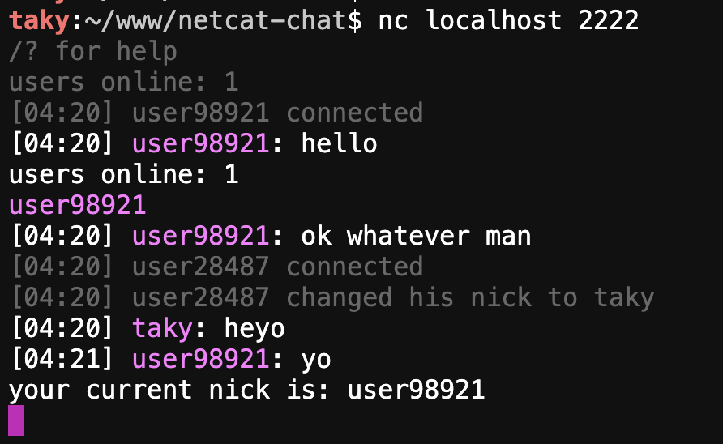

# netcat-chat

a simple, colorful chat server implemented in python that can be accessed using netcat.



## how it works

netcat-chat is a multi-user chat server that allows users to connect using netcat, a common networking utility. the server handles multiple connections simultaneously and provides a simple interface for chatting and performing basic commands.

### features:

- connect using netcat
- colorful output (gray for system messages, pink for user's own messages)
- simple commands for changing nicknames, listing users, and disconnecting
- broadcasts user join/leave messages
- configurable port via environment variable

### commands:

- `/nick <name>`: change your nickname
- `/list`: show online users
- `/?`: show help message
- `/bye`: disconnect from chat

## sample session:

```
/? for help
users online: 1
[08:23] user64100 connected
[08:23] user64100 changed his nick to taky
users online: 1
taky
[08:23] taky: heyo
/nick <name> - change your nick
/list - show online users
/? - show help
/bye - disconnect from chat
your current nick is: taky
[08:24] taky changed his nick to swrv
users online: 1
swrv
```

## how to use:

1. start the server by running the python script
   - by default, the server uses port 2222
   - to use a different port, set the `CHAT_PORT` environment variable:
     ```
     export CHAT_PORT=5000
     python chat_server.py
     ```
2. connect to the server using netcat: `nc <server_ip> <port>`
3. once connected, you'll see a welcome message and the number of online users
4. use the commands listed above to interact with the chat

## implementation details:

- written in python
- uses threading to handle multiple client connections
- implements a simple protocol for chat messages and commands
- uses ansi color codes for colorful output
- allows port configuration via the `CHAT_PORT` environment variable

enjoy chatting!
